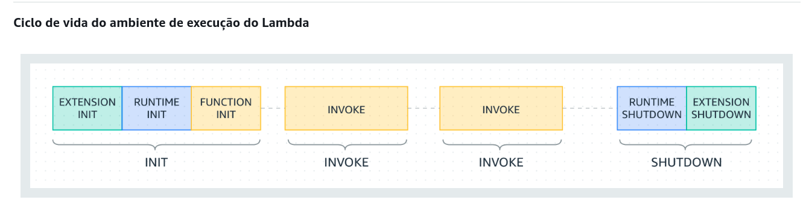
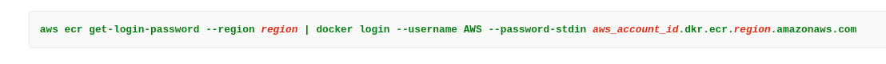
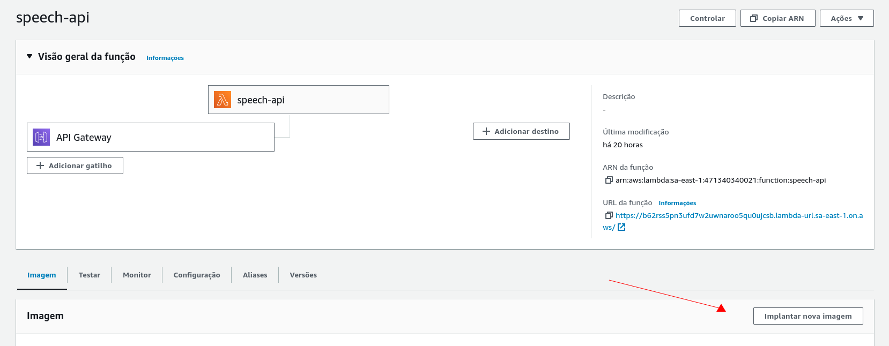
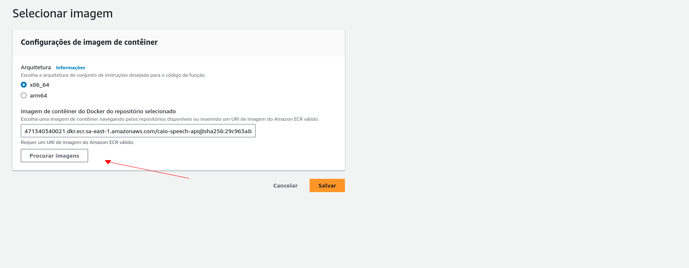

# Speech API/ Serverless

É importante observar que a performance de execução da biblioteca whisper, e o tempo de execução de transcrição estão diretamente ligados a quantidade de threads de CPU e WORKERS para trabalhar em cada tarefa.

Nossa função tem como esta url base para requisição: `https://b62rss5pn3ufd7w2uwnaroo5qu0ujcsb.lambda-url.sa-east-1.on.aws/` em sua execução acontece no diretório `/aws/app.py`.

Os modelos utilizados na transcrição do áudio são baixados no processo de build da imagem, você poderá analisar o download no arquivo `Dockerfile`. O audio recebido via requisição é armazenado temporariamente na pasta `/tmp` dentro da execução da função, e logo apoś o processo de `Shutdown` como mostrado abaixo, ela será descartada.

## Ciclo da função Lambda



Caso tenha mais dúvida, poderá conferir o trecho mais completos sobre todos os ciclos [aqui](https://docs.aws.amazon.com/pt_br/lambda/latest/dg/lambda-runtime-environment.html).

## Transcrição de áudio

Este endpoint faz a transcrição e validação do áudio de acordo com os parâmetros passados.

Requisição
- Método: `POST`
- URL: `https://b62rss5pn3ufd7w2uwnaroo5qu0ujcsb.lambda-url.sa-east-1.on.aws/`

O corpo da requisição deve ser um objeto com o seguinte modelo:

```json
{
	"expected_speech": "ENTRADA 13 40",
	"audio": "ARQUIVO EM BASE64"
}
```
Resposta de Sucesso
- Código de status: `200 OK`
- Corpo da resposta:
```json
{
	"validated": true,
	"spoken_text_in_audio": " Entrada 13 horas e 40."
}
```

`Observações`:

- O parâmetro `audio` deve ser enviado no formato `base64`.

- O parâmetro `audio` na requisição deve ser passado com espaços entre as strings, como no exemplo passado acima, e sem espaçoes no começo e final da string.

- Esta requisição **Não contém Header**, e os parâmetros devem ser enviados no formato json, exatamente como mostrado acima.


## Configurando AWS

Em nossa função Lambda, estamos utilizando imagens do docker e subindo para aws, portanto vou te ensinar como fazer isso também:

Precisamos autenticar a CLI do Docker em seu registro padrão. Dessa forma, o comando docker pode enviar e extrair imagens com o Amazon ECR.

```
aws ecr get-login-password --region region | docker login --username AWS --password-stdin aws_account_id.dkr.ecr.region.amazonaws.com
```

Caso tenha alguma dificuldade ou dúvida, poderá consultar a prórpia [documetação](https://docs.aws.amazon.com/AmazonECR/latest/userguide/getting-started-cli.html) da AWS.

Substitua as partes do comando acima como na imagem abaixo, substituindo os campo em vermelho por suas respectivas credenciais.



## Buildar Imagem

Próxima etapa será buildar a imagem do docker locamente em sua máquina:

Precisamos lembrar que as imagens da nossa função lambda estão no  Elastic Container Registry `speech-api-caio` na região ``

```
sudo docker build -t AWS_ACCOUNT_ID.dkr.ecr.REGIÃO.amazonaws.com/caio-speech-api:TAG DA SUA IMAGEM
```

Depois precisamos subir a sua image para o Elastic Container Registry `caio-speech-api`:

```
sudo docker push AWS_ACCOUNT_ID.dkr.ecr.REGIÃO.amazonaws.com/caio-speech-api:TAG DA SUA IMAGEM
```

Depois precisamos adicionar sua imagem a nossa função lambda no console da AWS.




